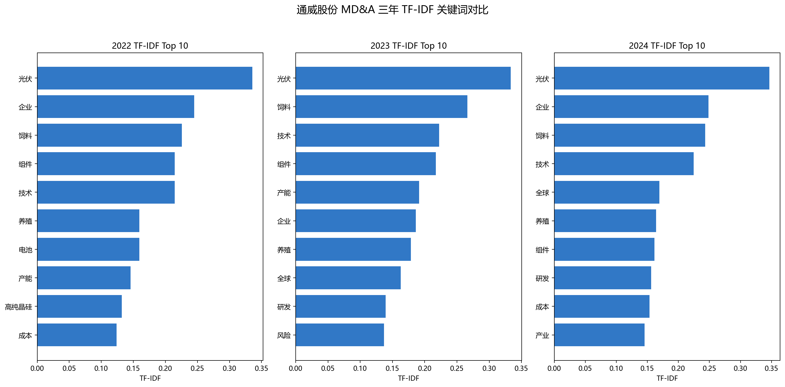
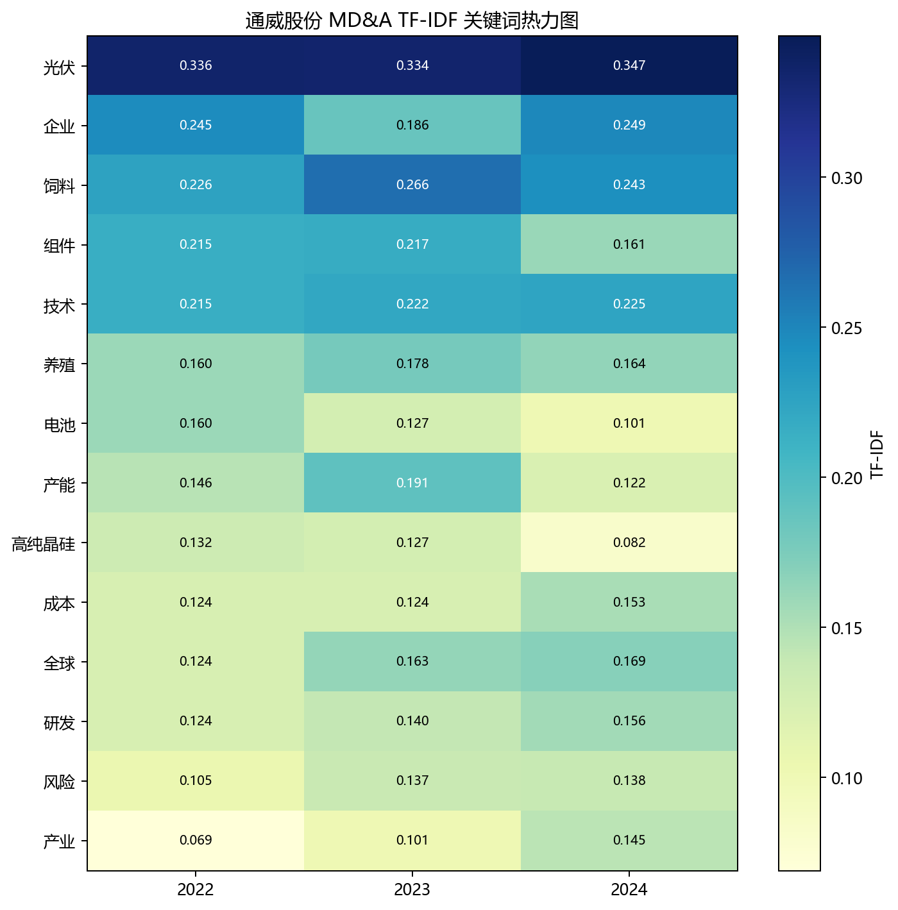
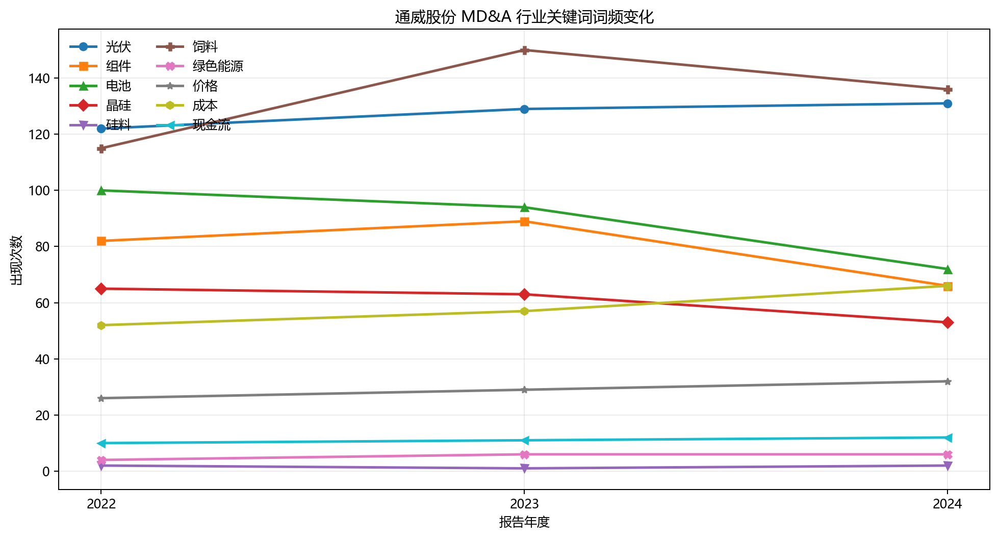
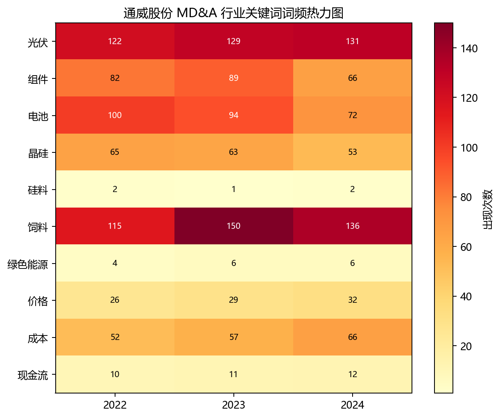
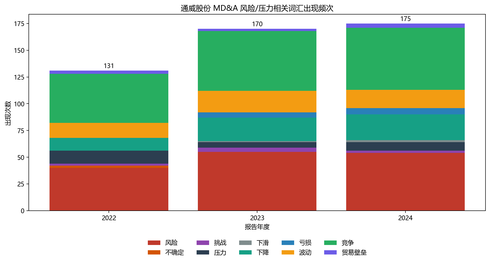
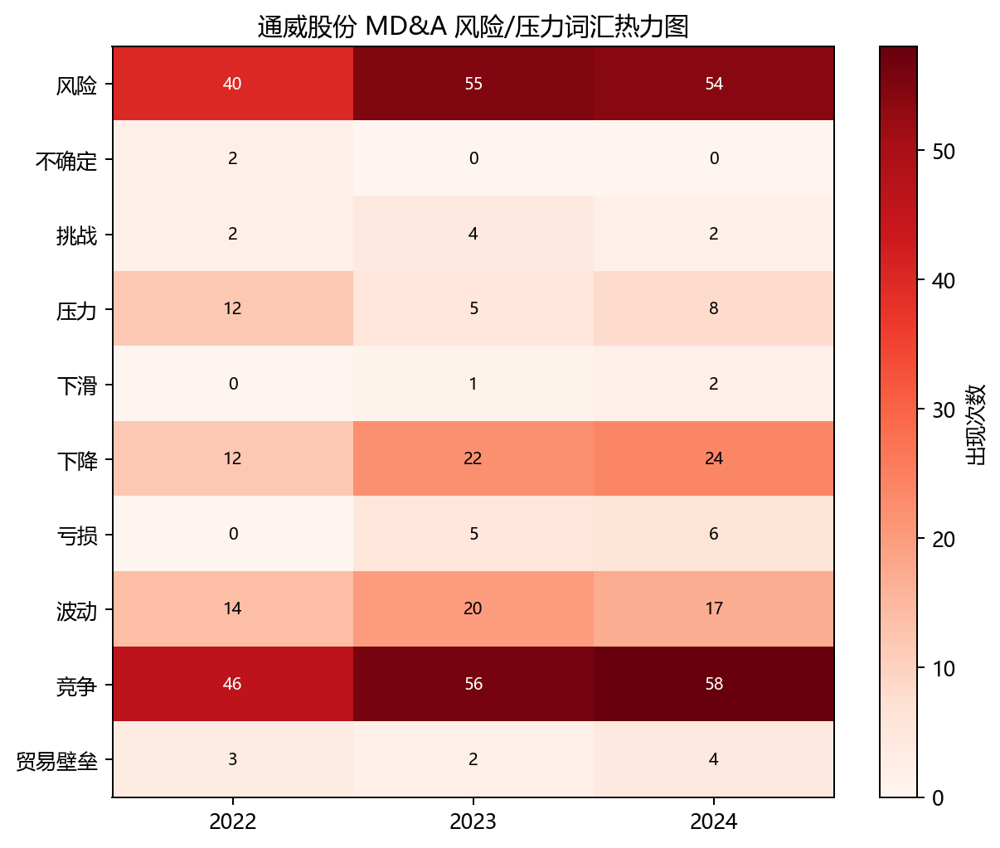

# 通威股份文本分析结果

## 词频与 TF-IDF

词频反映公司长期反复讨论的主题，TF-IDF 更强调某一年相对其他年份的区分度。通威股份三年 MD&A 中，`光伏、饲料、技术、组件、企业、研发、成本、风险` 等词长期靠前。

## 关键词变化趋势

选取 `光伏、组件、电池、晶硅、硅料、饲料、绿色能源、价格、成本、现金流` 等关键词观察三年变化。结果显示，`光伏`保持高频，`价格、成本、现金流`在 2024 年进一步上升，说明文本关注点从产业规模和产品描述，更多转向价格下行、成本控制和经营韧性。

## 风险词汇分析

风险词汇包括 `风险、不确定、挑战、压力、下滑、下降、亏损、波动、竞争、贸易壁垒`。风险词总频次从 2022 年的 131 次上升至 2024 年的 175 次，近两年披露强度更高。

需要注意，风险词频只能说明披露强度和文本关注点，不能直接推出经营风险的因果变化。
