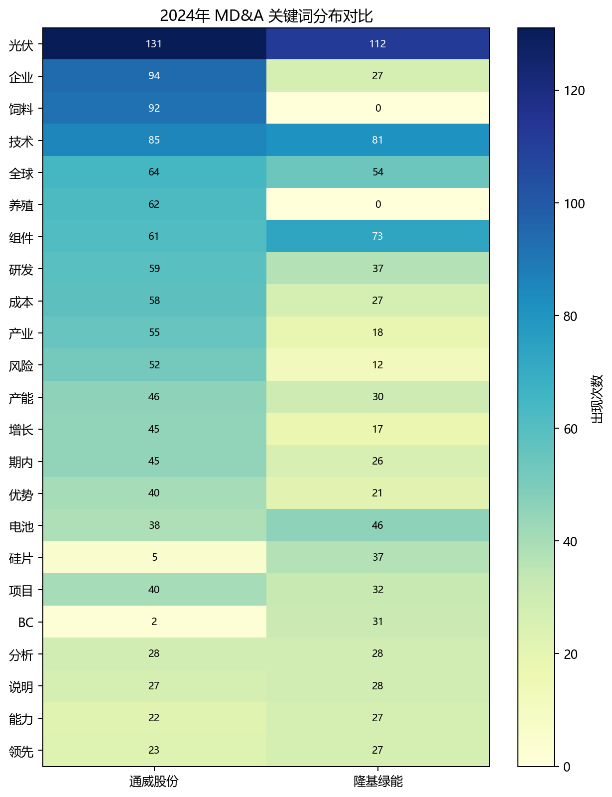
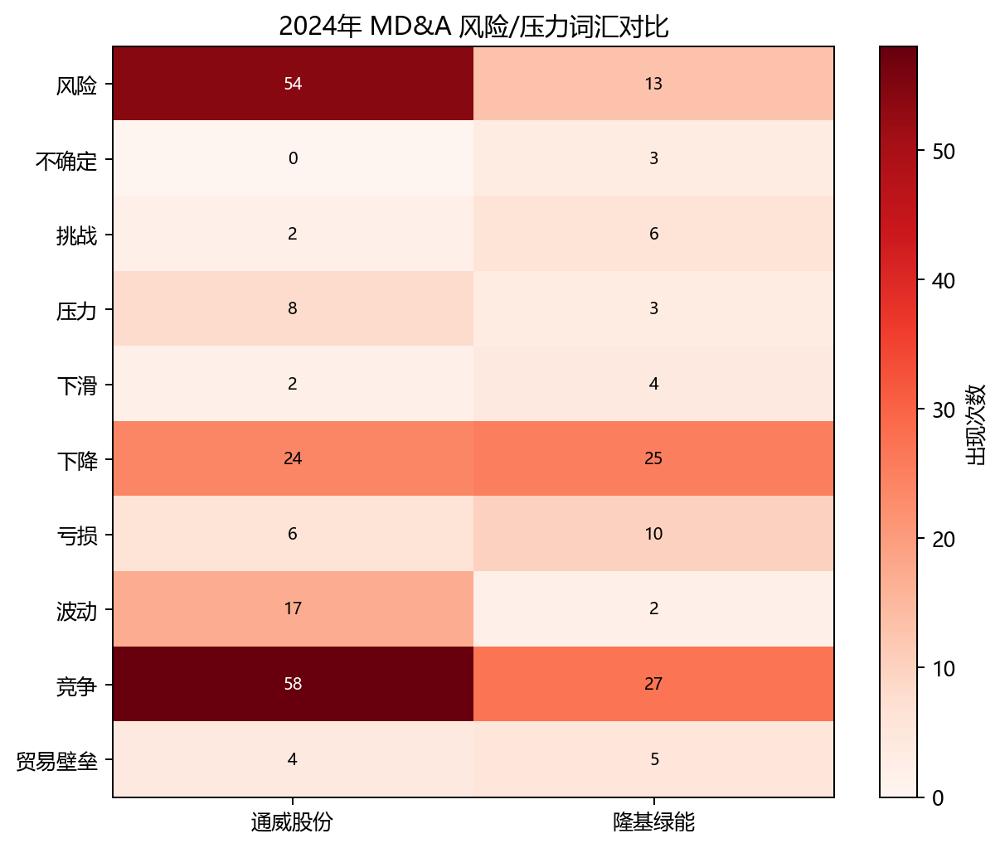

# 同行业公司比较

## 对比公司选择

同行业对比公司选择隆基绿能（601012）。选择理由是：隆基绿能与通威股份同属光伏产业链头部企业，业务体量和行业关注度接近；同时二者业务结构存在差异，通威股份覆盖农牧、高纯晶硅、电池组件等板块，隆基绿能更集中于硅片、电池、组件和 BC 技术路线。

比较口径为两家公司 2024 年年度报告 MD&A。

## 关键词分布差异

通威股份的 `饲料、养殖、高纯晶硅、产业链、风险` 更突出，体现其双主业和产业链纵深。隆基绿能的 `硅片、BC、组件、电池、领先、能力` 更突出，体现其光伏制造和技术路线叙事。

## 风险表达差异

2024 年通威股份风险词总频次为 175 次，隆基绿能为 98 次。通威股份在 `风险、竞争、波动、压力` 等词上更高；隆基绿能在 `下降、亏损、贸易壁垒、不确定、挑战` 等词上相对集中。

## 文本风格判断

两家公司文本风格有明显差异。通威股份更像“多业务经营复盘 + 风险提示”，覆盖农牧、晶硅、电池组件、现金流和供应链；隆基绿能更像“光伏制造与技术路线叙事”，重点围绕组件、电池、硅片、BC 技术和全球竞争展开。
